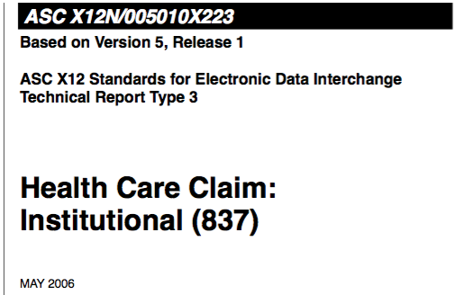
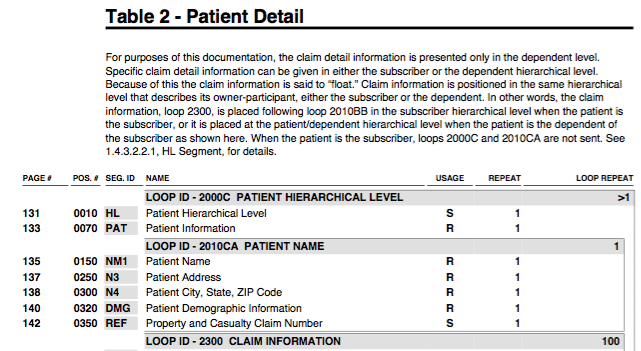
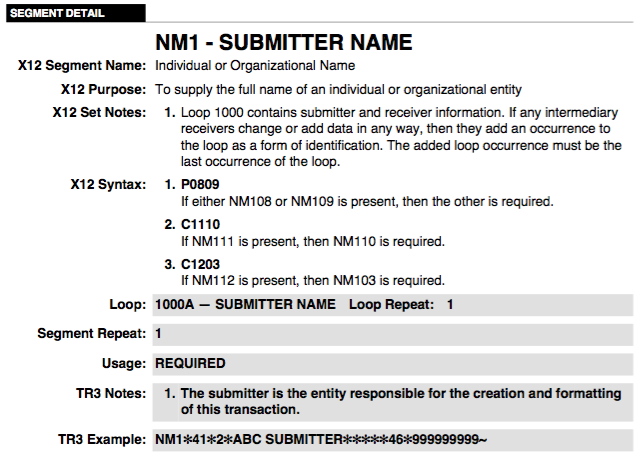
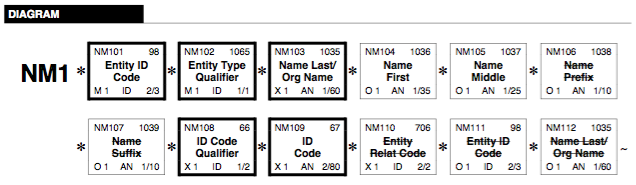
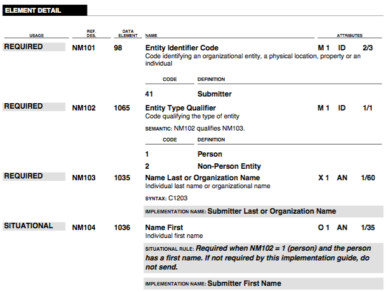

Be sure you start with the right documentation, which must be purchased from [ASC
X12](http://x12.org/). Documentation from a trading partner might be usable in a
pinch, but is often missing details or has details relevant only to that
partner. If you are unsure, the cover page for the document should look like
this:

## Tables

The overall structure of the grammr is given in section 2.2 of the
documentation (be sure it is marked `IMPLEMENTATION` and not `STANDARD`). The
top-level tables can be written as `TableDef.header`, `TableDef.detail`, and
`TableDef.summary`.

> Note for some reason, some grammars show the `SE` segment at the end of a
> detail table, rather than in its own summary table. The `SE` segment is the
> end of the document, so when you code up the grammar, you should create a
> `TableDef.summary` to contain the `SE` segment (see 837P). This is because
> a detail table can be repeated, while a summary table cannot, and the `SE`
> segment should only occur once in a document.

## Loops

Loops are groups of segments which have a particular starting segment that
indicates the start of the group, followed by other segments. Loops may be
nested, and each loop may be repeated a specified number of times. You can
translate each loop in the documentation to a `LoopDef.build(name, repeat_count,
*children)` where children are either segments or child loops.

In the example above, the `"2000C PATIENT HIERARCHY"` loop has a repeat count
of `RepeatCount.unbounded`, child segments `HL` and `PAT`, and many child loops
beginning with `"2000CA PATIENT NAME"`. Since `HL` is the first segment in the
loop, when the parser reads an `HL` in the right context, it will then create
the corresponding loop in the parse tree.

## Segments

Segments are sort of like a `struct` in the C programming language, where the
fields are called elements. Unlike structs, each time a segment occurs in the
grammar, it can be given a different name, different flags to indicate which
fields are required or optional, different set of allowed values in each field,
and a different number of allowed repeats.

One of the most commonly used segments is `NM1`, which is generally some kind of
name. In the above example, you an `NM1 Patient Name`, but there are many others
in the grammar for different people.

Segments can be described using `BuilderDsl.Segment(offset, id, name,
usage, repeat_count, *elements)`. The first argument comes from the `Pos. #`
column in the table diagram above. For instance, the `NM1 Patient Name` segment
has an offset of 150. The usage argument is denoted in a few places: on the
above diagram, it is the `Usage` column; this indicates if the segment is
required or optional.

## Elements

Elements are (apart from composite elements), some kind of atomic data type,
like a string, number, date, etc. Each place a segment is specified in the
grammar, its element properties are also specified. Beware that each "usage"
of a segment with the same identifier (e.g., `NM1`) will have different details
about its elements.

The important parts of the image above have probably already been transcribed in
a `SegmentDef` (unless you find a segment that hasn't been defined), which are
the same across all grammars (all the X12 attributes). The "loop", "usage", and
"repeat count" were described earlier, but are again shown here.

This diagram indicates some of the properties of each element, in this
particular instance of the `NM1` segemnt. The bold border around an element
indicates that it is `Required`, while strike-through text indicates a
`NotUsed`. If you encounter a segment that hasn't already been defined, some of
the other properties needed to define the segment are also included on the
diagram, but we'll ignore those for now.

The third section of each segment specification gives a name to each element,
usually in the gray section labeled `IMPLEMENTATION NAME`, and also specifies
its usage, allowed values, and minimum and maximum lengths. The usage indicator
is in the first column, name and allowed values in the fourth. Minimum and
maximum length, and number of decimal places are given in the last column, but
these rarely need to be specified as they are usually the same as the default
declared in the `ElementDef`.

